# Laboratório — Gerenciamento de Código-Fonte com Git e GitHub

> **Disciplina:** Engenharia de Software
> **Formato:** prática em duplas (trios são possíveis — o terceiro integrante reveza com o Aluno B)
> **Duração estimada:** 2 encontros de laboratório
> **Ferramentas:** Git, GitHub, Visual Studio Code
> **Entrega:** documento de evidências no canal definido pelo docente

---

## Sumário

0. [Antes de começar: por que controlar versões](#0-antes-de-começar-por-que-controlar-versões)
1. [Objetivos de aprendizagem](#1-objetivos-de-aprendizagem)
2. [Os conceitos que você vai usar](#2-os-conceitos-que-você-vai-usar)
3. [Parte 1 — Preparação do ambiente](#3-parte-1--preparação-do-ambiente)
4. [Parte 2 — Fork, colaborador e clone](#4-parte-2--fork-colaborador-e-clone)
5. [Parte 3 — O ciclo básico: editar, preparar, registrar, enviar](#5-parte-3--o-ciclo-básico-editar-preparar-registrar-enviar)
6. [Parte 4 — Trabalho em paralelo: fetch, pull e merge automático](#6-parte-4--trabalho-em-paralelo-fetch-pull-e-merge-automático)
7. [Parte 5 — Conflito de merge](#7-parte-5--conflito-de-merge)
8. [Parte 6 — Branches](#8-parte-6--branches)
9. [Parte 7 — Pull Request, revisão e merge](#9-parte-7--pull-request-revisão-e-merge)
10. [Parte 8 — Conflito dentro de um Pull Request](#10-parte-8--conflito-dentro-de-um-pull-request)
11. [Parte 9 — Desfazendo coisas com segurança](#11-parte-9--desfazendo-coisas-com-segurança)
12. [Problemas comuns](#12-problemas-comuns)
13. [Resumo de comandos](#13-resumo-de-comandos)
14. [Glossário](#14-glossário)
15. [Evidências e entrega](#15-evidências-e-entrega)
16. [Referências](#16-referências)

---

## 0. Antes de começar: por que controlar versões

Imagine um trabalho em grupo feito por troca de arquivos: `site_final.zip`, `site_final_v2.zip`, `site_final_AGORA_VAI.zip`. Três problemas aparecem rápido:

- **Ninguém sabe qual é a versão certa.**
- **Quando duas pessoas mexem no mesmo arquivo, o trabalho de uma apaga o da outra.**
- **Quando algo quebra, não há como voltar ao último estado que funcionava.**

Um **sistema de controle de versão** resolve os três: guarda cada estado do projeto como um ponto do histórico, sabe quem mudou o quê e quando, e ajuda a combinar o trabalho de várias pessoas sem que uma sobrescreva a outra.

O **Git** é o sistema de controle de versão usado pela grande maioria das equipes de software hoje. O **GitHub** é um serviço que hospeda repositórios Git na internet e acrescenta ferramentas de colaboração, como o Pull Request.

> **Git ≠ GitHub.** O Git roda no seu computador e funciona até sem internet. O GitHub é um lugar onde as equipes guardam uma cópia compartilhada do repositório.

---

## 1. Objetivos de aprendizagem

Ao final deste laboratório, você será capaz de:

| Nível (Bloom) | Objetivo |
|---|---|
| **Lembrar** | Identificar os comandos fundamentais do Git e a finalidade de cada um |
| **Compreender** | Explicar as quatro áreas do Git e o que cada comando move entre elas |
| **Compreender** | Distinguir fork de clone, e fetch de pull |
| **Aplicar** | Executar o ciclo completo: clonar, alterar, registrar, enviar e receber alterações |
| **Aplicar** | Trabalhar com branches e integrar mudanças por meio de Pull Request |
| **Analisar** | Diagnosticar por que um push foi rejeitado e por que um conflito ocorreu |
| **Avaliar** | Resolver conflitos decidindo, junto com o colega, qual conteúdo deve prevalecer |

### Tempo estimado por etapa

| Etapa | Tempo estimado |
|---|---:|
| Parte 1 — Preparação do ambiente | 15 minutos |
| Parte 2 — Fork, colaborador e clone | 15 minutos |
| Parte 3 — O ciclo básico | 25 minutos |
| Parte 4 — Trabalho em paralelo | 20 minutos |
| Parte 5 — Conflito de merge | 25 minutos |
| Parte 6 — Branches | 20 minutos |
| Parte 7 — Pull Request, revisão e merge | 25 minutos |
| Parte 8 — Conflito dentro de um Pull Request | 25 minutos |
| Parte 9 — Desfazendo coisas com segurança | 10 minutos |
| **Total** | **180 minutos (3 horas)** |

---

## 2. Os conceitos que você vai usar

Leia esta seção antes de digitar qualquer comando. Os comandos só fazem sentido quando você sabe **o que eles estão movendo e para onde**.

### 2.1 As quatro áreas do Git

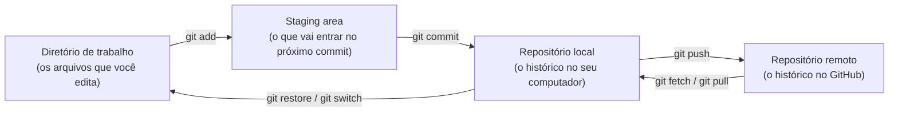

| Área | O que é | Analogia |
|---|---|---|
| **Diretório de trabalho** | A pasta com os arquivos que você edita no VS Code | A mesa onde você escreve |
| **Staging area** | A seleção de mudanças que vão compor o próximo commit | A caixa onde você separa o que vai enviar |
| **Repositório local** | O histórico completo, guardado na pasta oculta `.git` | O seu arquivo de cópias registradas |
| **Repositório remoto** | A cópia do histórico no GitHub, compartilhada pela equipe | O arquivo central do escritório |

> **Por que existe a staging area?** Porque nem tudo que você alterou precisa entrar no mesmo registro. Você pode ter corrigido um erro e começado outra funcionalidade: a staging area permite registrar só a correção agora e a funcionalidade depois, em commits separados e com mensagens claras.

### 2.2 O que é um commit

Um **commit** é uma fotografia do projeto em um determinado momento, acompanhada de:

- um **identificador único** (um código como `a3f9c21`)
- **autor** e **data**
- uma **mensagem** explicando o que mudou
- uma referência ao **commit anterior** (o "pai")

É essa referência ao anterior que transforma os commits em uma **linha do tempo**:

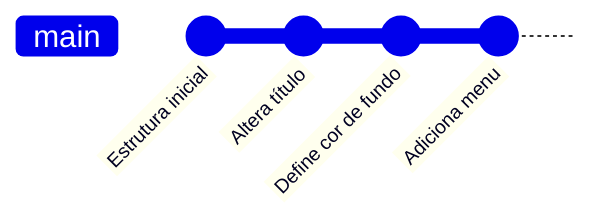

> O commit é **local**. Ele fica apenas no seu computador até você executar `git push`.

### 2.3 Fork e clone

| | Fork | Clone |
|---|---|---|
| **Onde acontece** | No GitHub | No seu computador |
| **O que cria** | Uma cópia do repositório na sua conta do GitHub | Uma cópia do repositório na sua máquina |
| **Para que serve** | Ter um repositório próprio, independente do original | Poder editar, registrar e testar localmente |
| **Comando** | Botão **Fork** na página do GitHub | `git clone <url>` |

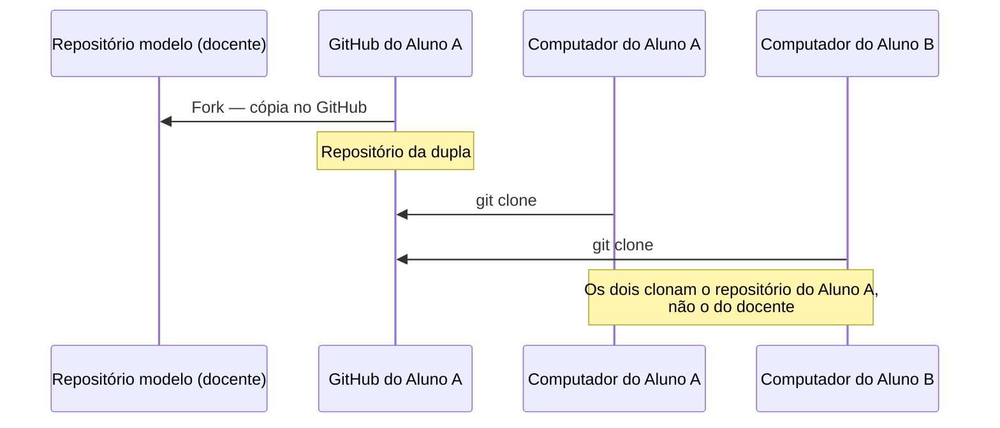

### 2.4 Os papéis da dupla

| Papel | Responsabilidade |
|---|---|
| **Aluno A — dono** | Faz o fork, convida o colega e é o primeiro a alterar o projeto |
| **Aluno B — colaborador** | Aceita o convite, clona o repositório do Aluno A e colabora |

Os papéis se invertem em vários momentos. Ao final, os dois terão feito tudo.

---

## 3. Parte 1 — Preparação do ambiente

**Tempo estimado:** 15 minutos · **Quem:** os dois alunos, cada um no seu computador

### Passo 1.1 — Verificar o que está instalado

- [ ] Conta no GitHub ([github.com](https://github.com))
- [ ] Git instalado ([git-scm.com](https://git-scm.com/downloads)) — no Windows, mantenha marcada a opção **"Git from the command line and also from 3rd-party software"**
- [ ] Visual Studio Code instalado ([code.visualstudio.com](https://code.visualstudio.com/))
- [ ] Extensão **GitLens** no VS Code (opcional, ajuda a visualizar o histórico)

Abra o terminal do VS Code (menu **Terminal → New Terminal**) e execute:

```bash
git --version
```

Saída esperada (a versão pode variar):

```
git version 2.47.1.windows.1
```

> Se o comando não for reconhecido, feche e reabra o VS Code. Se persistir, reinstale o Git.

### Passo 1.2 — Configurar a sua identidade

O Git grava o seu nome e o seu e-mail em **cada commit**. Configure uma única vez por computador:

```bash
git config --global user.name "Seu Nome Completo"
git config --global user.email "seu-email@exemplo.com"
```

> **Use o mesmo e-mail cadastrado na sua conta do GitHub.** É por ele que o GitHub associa os commits ao seu perfil. Com outro e-mail, seus commits aparecem como se fossem de um desconhecido — e a sua participação não fica comprovada.

**`--global` ou não?** Com `--global`, a configuração vale para todos os repositórios do computador. Sem ela, vale só para o repositório em que você está. Em computador compartilhado de laboratório, prefira configurar **sem** `--global`, dentro da pasta do projeto, depois do clone.

### Passo 1.3 — Definir o comportamento do `pull`

```bash
git config --global pull.rebase false
```

> **Por que isto é necessário?** Quando o seu histórico local e o remoto seguiram caminhos diferentes, o `git pull` precisa saber **como** combiná-los. Esta configuração diz: *combine fazendo um merge*, que é o comportamento usado neste roteiro. Sem ela, versões recentes do Git interrompem o `pull` com a mensagem `fatal: Need to specify how to reconcile divergent branches` — exatamente no momento da Parte 4.

### Passo 1.4 — Conferir as configurações

```bash
git config --list --show-origin
```

Procure as linhas `user.name`, `user.email` e `pull.rebase` e confirme os valores.

### Passo 1.5 — Autenticar o VS Code no GitHub

1. No VS Code, clique no ícone de **conta** (canto inferior esquerdo).
2. Escolha **Sign in with GitHub** e autorize no navegador.
3. Volte ao VS Code.

> O GitHub **não aceita a senha da conta** em operações de linha de comando. A autenticação é feita pelo navegador (como acima) ou por token. Se aparecer um pedido de usuário e senha no terminal, veja a seção [Problemas comuns](#12-problemas-comuns).

**Checkpoint 1** — `git config user.name` e `git config user.email` mostram seus dados corretos.

---

## 4. Parte 2 — Fork, colaborador e clone

**Tempo estimado:** 15 minutos

### Passo 2.1 — Aluno A: criar o fork

1. Acesse o repositório modelo indicado pelo docente:
   `https://github.com/<organizacao-da-disciplina>/<repositorio-modelo>`
2. Clique em **Fork** (canto superior direito).
3. Na tela de criação:
   - **Owner:** sua conta pessoal
   - **Repository name:** use o padrão `scm-<nome-a>-<nome-b>` (por exemplo, `scm-joao-maria`)
   - Mantenha marcada a opção **Copy the main branch only**
4. Clique em **Create fork**.

> **Evidência 1 — Aluno A:** página inicial do fork, mostrando o nome do repositório e o aviso *"forked from…"*.

### Passo 2.2 — Aluno A: convidar o colaborador

1. No fork, vá em **Settings → Collaborators → Add people**.
2. Pesquise o **nome de usuário do GitHub** do Aluno B.
3. Confirme o convite.

> **Evidência 2 — Aluno A:** tela **Settings → Collaborators** com o Aluno B listado.

### Passo 2.3 — Aluno B: aceitar o convite

Acesse [github.com/notifications](https://github.com/notifications) ou o e-mail e aceite o convite.

> **Por que convidar?** Sem o convite, o Aluno B consegue **ler** o repositório, mas não **enviar** alterações para ele. Colaborador é quem tem permissão de escrita.

### Passo 2.4 — Os dois: clonar o repositório

Cada aluno clona **o repositório do Aluno A**, não o modelo do docente.

1. No fork, clique no botão verde **Code** e copie a URL **HTTPS**.
2. No terminal do VS Code:

```bash
cd Documents
git clone https://github.com/<usuario-aluno-a>/scm-<nome-a>-<nome-b>.git
cd scm-<nome-a>-<nome-b>
code .
```

3. Confira de onde o clone veio:

```bash
git remote -v
```

Saída esperada:

```
origin  https://github.com/<usuario-aluno-a>/scm-<nome-a>-<nome-b>.git (fetch)
origin  https://github.com/<usuario-aluno-a>/scm-<nome-a>-<nome-b>.git (push)
```

> **O que é `origin`?** É o **apelido** que o Git dá ao repositório remoto de onde você clonou. Quando você escreve `git push origin main`, está dizendo: *envie para o remoto chamado origin, na branch main*.

> **Evidência 3 — ambos:** terminal com a saída do `git clone` e do `git remote -v`, cada um no seu computador.

**Checkpoint 2** — os dois alunos têm a pasta do projeto aberta no VS Code, e `git remote -v` aponta para o repositório do Aluno A.

---

## 5. Parte 3 — O ciclo básico: editar, preparar, registrar, enviar

**Tempo estimado:** 25 minutos · **Quem altera:** Aluno A · **Aluno B:** acompanha e depois recebe

Este é o ciclo que você vai repetir centenas de vezes na vida profissional:

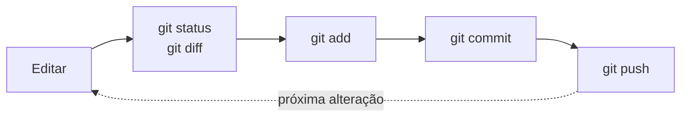

### Passo 3.1 — Aluno A: alterar um arquivo

Abra o `index.html`, localize o título principal dentro do `<header>` e altere:

```html
<!-- ANTES -->
<h1>Nome do Projeto</h1>

<!-- DEPOIS -->
<h1>DevLab — Soluções Digitais</h1>
```

Salve com `Ctrl + S`.

### Passo 3.2 — Aluno A: perguntar ao Git o que mudou

```bash
git status
```

```
On branch main
Your branch is up to date with 'origin/main'.

Changes not staged for commit:
        modified:   index.html
```

**Leia a saída com atenção.** Ela diz três coisas:

- você está na branch `main`
- ainda não há nada novo em relação ao remoto
- `index.html` foi alterado, mas a alteração **ainda não está na staging area**

Agora veja **exatamente** o que mudou:

```bash
git diff
```

```diff
-    <h1>Nome do Projeto</h1>
+    <h1>DevLab — Soluções Digitais</h1>
```

> Linhas com `-` foram removidas; linhas com `+` foram adicionadas. **Crie o hábito de rodar `git diff` antes de todo commit** — é a sua última chance de perceber que alterou algo sem querer.

### Passo 3.3 — Aluno A: preparar a alteração

```bash
git add index.html
git status
```

```
Changes to be committed:
        modified:   index.html
```

A alteração passou da área de trabalho para a **staging area**.

> **E o `git add .`?** O ponto adiciona **todas** as alterações da pasta. É prático, mas é justamente como arquivos indesejados entram no histórico. Enquanto estiver aprendendo, adicione arquivo por arquivo e confira com `git status`.

### Passo 3.4 — Aluno A: registrar o commit

```bash
git commit -m "Altera título da landing page para DevLab"
```

```
[main a3f9c21] Altera título da landing page para DevLab
 1 file changed, 1 insertion(+), 1 deletion(-)
```

`a3f9c21` é o identificador do seu commit — no seu terminal ele será diferente.

**Como escrever uma boa mensagem de commit:**

| Regra | Exemplo bom | Exemplo ruim |
|---|---|---|
| Verbo no imperativo | `Adiciona formulário de contato` | `Adicionei o formulário` |
| Diz **o que** mudou | `Corrige alinhamento do menu no celular` | `ajustes` |
| Uma mudança por commit | `Define cor de fundo do body` | `várias alterações` |
| Curta na primeira linha | até ~60 caracteres | um parágrafo inteiro |

Veja o histórico:

```bash
git log --oneline
```

```
a3f9c21 (HEAD -> main) Altera título da landing page para DevLab
e81b0d4 (origin/main, origin/HEAD) Estrutura inicial
```

> **Repare:** `HEAD -> main` está no seu commit novo, mas `origin/main` ainda está no anterior. Isso significa que **o GitHub ainda não sabe do seu commit**. Ele existe apenas no seu computador.

### Passo 3.5 — Aluno A: enviar para o GitHub

```bash
git push origin main
```

```
To https://github.com/<usuario-aluno-a>/scm-<nome-a>-<nome-b>.git
   e81b0d4..a3f9c21  main -> main
```

Rode `git log --oneline` de novo: agora `origin/main` também aponta para `a3f9c21`.

> **Evidência 4 — Aluno A:** aba **Commits** do repositório no GitHub, mostrando o commit com o seu nome de usuário.

### Passo 3.6 — Aluno B: receber a alteração

No computador do Aluno B:

```bash
git pull origin main
```

```
Updating e81b0d4..a3f9c21
Fast-forward
 index.html | 2 +-
 1 file changed, 1 insertion(+), 1 deletion(-)
```

> **O que é *fast-forward*?** O Aluno B não tinha nenhum commit novo, então o Git só precisou **avançar o ponteiro** da branch até o commit do Aluno A. Não houve nada para combinar.

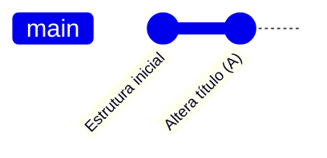

> **Evidência 5 — Aluno B:** terminal com a saída do `git pull` e o `index.html` aberto mostrando o título novo.

### Passo 3.7 — Invertam os papéis

Agora o **Aluno B** altera e o **Aluno A** recebe.

**Aluno B**, no `style.css`, defina a regra do `body`:

```css
body {
    background-color: #f0f4f8;
    font-family: 'Segoe UI', Tahoma, Geneva, Verdana, sans-serif;
}
```

Em seguida, execute o ciclo completo — **sem olhar os passos anteriores, se conseguir**:

```bash
git status
git diff
git add style.css
git commit -m "Define cor de fundo e fonte padrão do body"
git push origin main
```

**Aluno A:**

```bash
git pull origin main
```

**Aluno A**, agora adicione um menu de navegação logo abaixo do `<h1>` no `index.html`. Ele será usado nas Partes 7 e 8:

```html
<nav>
  <ul class="menu">
    <li><a href="#inicio">Início</a></li>
  </ul>
</nav>
```

```bash
git add index.html
git commit -m "Adiciona menu de navegação"
git push origin main
```

**Aluno B:** `git pull origin main`.

> **Evidência 6 — Aluno B:** terminal com o `git push` do Passo 3.7 concluído com sucesso.

**Checkpoint 3** — os dois executam `git log --oneline` e veem **exatamente o mesmo histórico**, com commits dos dois alunos.

---

## 6. Parte 4 — Trabalho em paralelo: fetch, pull e merge automático

**Tempo estimado:** 20 minutos

Até aqui, um aluno esperava o outro terminar. Na vida real, as pessoas trabalham **ao mesmo tempo**. Vamos ver o que acontece — primeiro em **arquivos diferentes**.

> Antes de começar, os dois executam `git pull origin main`.

### Passo 4.1 — Aluno A: alterar `script.js` e enviar

```javascript
// Mensagem exibida no console ao carregar a página
document.addEventListener('DOMContentLoaded', function () {
    console.log('DevLab — página carregada com sucesso!');
});
```

```bash
git add script.js
git commit -m "Adiciona log de carregamento da página"
git push origin main
```

### Passo 4.2 — Aluno B: alterar `index.html` sem receber antes

**Sem fazer pull**, o Aluno B adiciona um parágrafo logo abaixo do `<nav>`:

```html
<p class="descricao">Transformando ideias em soluções digitais.</p>
```

```bash
git add index.html
git commit -m "Adiciona parágrafo de descrição"
git push origin main
```

Resultado esperado — **o push é recusado**:

```
 ! [rejected]        main -> main (fetch first)
error: failed to push some refs to '...'
hint: Updates were rejected because the remote contains work that you do not
hint: have locally.
```

> **O que aconteceu?** O remoto tem um commit (o do Aluno A) que o Aluno B não tem. Se o Git aceitasse o push, **o commit do Aluno A desapareceria**. O Git se recusa a apagar trabalho alheio — e isso é uma proteção, não um defeito.

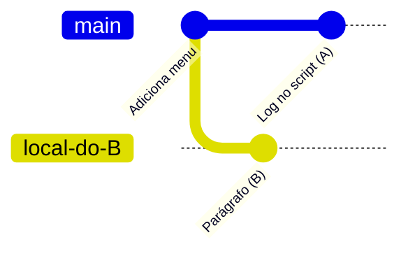

As duas linhas saíram do mesmo ponto e seguiram caminhos diferentes: os históricos **divergiram**.

### Passo 4.3 — Aluno B: olhar antes de trazer (`fetch`)

```bash
git fetch origin
git status
```

```
Your branch and 'origin/main' have diverged,
and have 1 and 1 different commits each, respectively.
```

> **`fetch` e `pull` não são a mesma coisa.**
>
> | Comando | O que faz |
> |---|---|
> | `git fetch` | **Baixa** o que há de novo no remoto, mas **não mexe** nos seus arquivos |
> | `git pull` | Faz o `fetch` **e em seguida combina** o que veio com o seu trabalho |
>
> Em outras palavras: **`pull` = `fetch` + `merge`**. O `fetch` é seguro sempre; permite ver o que mudou antes de decidir.

Veja o que o Aluno A fez:

```bash
git log --oneline main..origin/main
```

### Passo 4.4 — Aluno B: combinar e enviar

```bash
git pull origin main
```

O VS Code pode abrir um editor com uma mensagem de merge pronta. Aceite a mensagem: salve e feche a aba (ou, no editor de terminal, digite `:wq` e Enter).

```
Merge made by the 'ort' strategy.
 script.js | 4 ++++
 1 file changed, 4 insertions(+)
```

Como os commits alteraram **arquivos diferentes**, o Git combinou tudo sozinho e criou um **commit de merge** — um commit com **dois pais**.

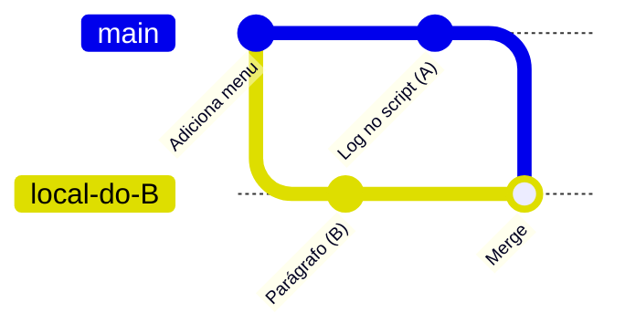

Agora sim:

```bash
git push origin main
```

**Aluno A:** `git pull origin main`.

### Passo 4.5 — Os dois: ver o histórico como um grafo

```bash
git log --oneline --graph --all
```

```
*   c7d2e90 (HEAD -> main, origin/main) Merge branch 'main' of https://...
|\
| * 5b31a0f Adiciona log de carregamento da página
* | 9e4c812 Adiciona parágrafo de descrição
|/
* 2d8f7aa Adiciona menu de navegação
```

> **Evidência 7 — ambos:** saída do `git log --oneline --graph --all` mostrando a bifurcação e o commit de merge.

**Checkpoint 4** — o `index.html` tem o parágrafo **e** o `script.js` tem o log, nos dois computadores.

> **Regra de ouro:** faça `git pull` **antes de começar** a trabalhar e **antes de fazer push**. Quanto mais tempo você fica sem sincronizar, maior a chance de os históricos divergirem.

---

## 7. Parte 5 — Conflito de merge

**Tempo estimado:** 25 minutos

Na Parte 4, o Git combinou sozinho porque as mudanças estavam em arquivos diferentes. Agora vamos provocar a situação em que ele **não consegue decidir**.

### 7.1 O que é um conflito

Um conflito acontece quando **duas pessoas alteram as mesmas linhas do mesmo arquivo** em commits diferentes. O Git não sabe qual versão é a certa — e, sensatamente, **não escolhe por você**.

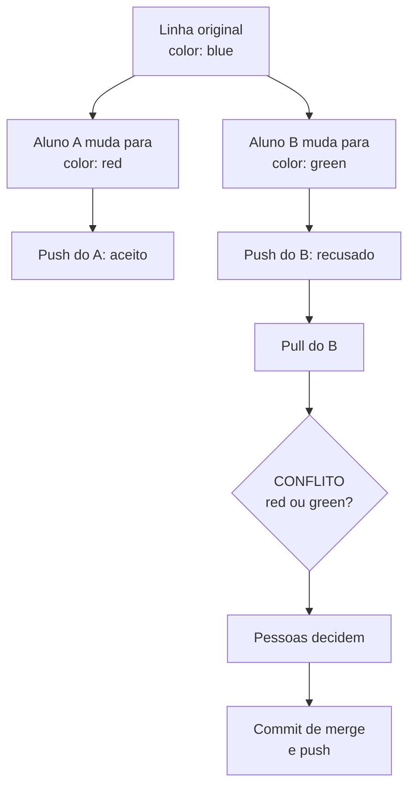

> **Conflito não é erro.** É o Git pedindo que **pessoas** tomem uma decisão que ele não pode tomar sozinho. Resolver conflito é uma conversa entre desenvolvedores, não um problema técnico.

### Passo 5.1 — Os dois: sincronizar

```bash
git pull origin main
```

### Passo 5.2 — Aluno A: alterar a regra do `h1`

No `style.css`, localize ou crie a regra do `h1`:

```css
h1 {
    color: #e74c3c;
    font-size: 2.5rem;
    text-align: center;
}
```

```bash
git add style.css
git commit -m "Define estilo do título em vermelho e centralizado"
git push origin main
```

### Passo 5.3 — Aluno B: alterar as mesmas linhas

**Sem fazer pull**, o Aluno B altera **a mesma regra**:

```css
h1 {
    color: #2ecc71;
    font-size: 3rem;
    text-align: left;
}
```

```bash
git add style.css
git commit -m "Define estilo do título em verde e à esquerda"
git push origin main
```

O push é recusado, como na Parte 4. Agora:

```bash
git pull origin main
```

```
Auto-merging style.css
CONFLICT (content): Merge conflict in style.css
Automatic merge failed; fix conflicts and then commit the result.
```

### Passo 5.4 — Aluno B: ler o conflito

```bash
git status
```

```
You have unmerged paths.
  (fix conflicts and run "git commit")

Unmerged paths:
        both modified:   style.css
```

Abra o `style.css`:

```css
h1 {
<<<<<<< HEAD
    color: #2ecc71;
    font-size: 3rem;
    text-align: left;
=======
    color: #e74c3c;
    font-size: 2.5rem;
    text-align: center;
>>>>>>> 4f1a9b3
}
```

| Marcador | Significado |
|---|---|
| `<<<<<<< HEAD` | Início da **sua** versão — o que está no seu repositório local (Aluno B) |
| `=======` | Divisão entre as duas versões |
| `>>>>>>> 4f1a9b3` | Fim da versão que **chegou do remoto** (Aluno A) |

> **Os marcadores não são código CSS.** O Git os escreveu dentro do arquivo para mostrar as duas versões lado a lado. Se ficarem no arquivo, a página quebra.

### Passo 5.5 — A dupla: decidir e resolver

O VS Code mostra botões acima do conflito:

| Botão | O que faz |
|---|---|
| **Accept Current Change** | Mantém só a versão local (Aluno B) |
| **Accept Incoming Change** | Mantém só a versão que chegou (Aluno A) |
| **Accept Both Changes** | Mantém as duas, uma depois da outra — quase sempre exige ajuste manual |
| **Compare Changes** | Mostra as versões lado a lado |

**Para este exercício, conversem e cheguem a uma versão combinada.** Por exemplo:

```css
h1 {
    color: #2ecc71;       /* cor escolhida pelo Aluno B */
    font-size: 2.5rem;    /* tamanho escolhido pelo Aluno A */
    text-align: center;   /* alinhamento escolhido pelo Aluno A */
}
```

**Confira que não sobrou nenhum marcador** (`<<<<<<<`, `=======`, `>>>>>>>`) e salve.

### Passo 5.6 — Aluno B: concluir o merge

```bash
git add style.css
git status
```

```
All conflicts fixed but you are still merging.
  (use "git commit" to conclude merge)
```

> **Por que `git add` num arquivo que já estava versionado?** Porque, durante um conflito, `git add` significa: *"este arquivo está resolvido"*.

```bash
git commit -m "Resolve conflito no estilo do título (decisão da dupla)"
git push origin main
```

**Aluno A:** `git pull origin main`.

> **Se quiser desistir no meio de um conflito**, antes de fazer o commit: `git merge --abort`. O repositório volta ao estado anterior ao `pull`.

**Checkpoint 5**

- [ ] O `style.css` não tem marcadores de conflito, nos dois computadores
- [ ] A página abre no navegador com o estilo combinado
- [ ] `git log --oneline --graph` mostra o commit de merge

> **Evidência 8a — Aluno B:** `style.css` no VS Code **depois** da resolução, sem marcadores.
> **Evidência 8b — ambos:** página aberta no navegador com o estilo combinado.

---

## 8. Parte 6 — Branches

**Tempo estimado:** 20 minutos

### 8.1 O problema que a branch resolve

Até agora, os dois trabalharam direto na `main`. Isso tem um custo: qualquer coisa enviada entra imediatamente na versão principal, **inclusive o que ainda está pela metade ou com erro**.

Uma **branch** é uma linha de desenvolvimento independente. Você cria uma, trabalha nela à vontade e só leva o resultado para a `main` quando estiver pronto — de preferência depois que alguém revisar.

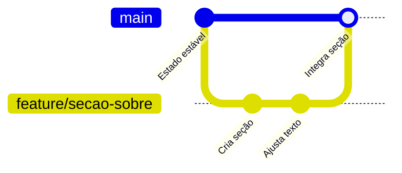

> **Tecnicamente, uma branch é só um ponteiro** para um commit, que avança sozinho a cada novo commit. Criar uma branch é instantâneo e não copia arquivos. Por isso as equipes criam branches o tempo todo.

**Convenção de nome:** `tipo/descricao-curta`, sem espaços nem acentos. Exemplos: `feature/secao-sobre`, `fix/menu-mobile`, `docs/readme`.

### Passo 6.1 — Os dois: sincronizar e ver as branches

```bash
git switch main
git pull origin main
git branch
```

```
* main
```

O asterisco indica a branch em que você está.

### Passo 6.2 — Cada aluno cria a sua branch

**Aluno A:**

```bash
git switch -c feature/secao-sobre
```

**Aluno B:**

```bash
git switch -c feature/secao-contato
```

> `git switch -c` **cria** a branch e **muda** para ela. Em materiais antigos você verá `git checkout -b`, que faz a mesma coisa.

```bash
git branch
```

```
* feature/secao-sobre
  main
```

### Passo 6.3 — Aluno A: trabalhar na branch

Adicione ao `index.html`, antes de `</body>`:

```html
<section id="sobre">
  <h2>Sobre nós</h2>
  <p>A DevLab desenvolve soluções digitais sob medida.</p>
</section>
```

```bash
git add index.html
git commit -m "Adiciona seção Sobre"
git push -u origin feature/secao-sobre
```

> **O que é o `-u`?** No primeiro push de uma branch nova, o `-u` liga a branch local à branch remota de mesmo nome. Depois disso, basta `git push` e `git pull`, sem repetir `origin` e o nome da branch.

### Passo 6.4 — Aluno B: trabalhar na branch

Adicione ao `index.html`, antes de `</body>`:

```html
<section id="contato">
  <h2>Contato</h2>
  <p>Escreva para contato@devlab.exemplo</p>
</section>
```

```bash
git add index.html
git commit -m "Adiciona seção Contato"
git push -u origin feature/secao-contato
```

### Passo 6.5 — Os dois: observar o isolamento

**Aluno A**, volte para a `main`:

```bash
git switch main
```

Abra o `index.html`: **a seção Sobre sumiu**. Agora volte:

```bash
git switch feature/secao-sobre
```

Ela reapareceu.

> **O que aconteceu?** Ao trocar de branch, o Git substitui os arquivos da pasta pelos da branch escolhida. O seu trabalho não se perdeu: ele está guardado no commit da branch. **É isso que torna seguro experimentar numa branch.**

> **Cuidado:** troque de branch sempre com o `git status` limpo. Alterações não registradas acompanham você na troca — ou impedem a troca.

> **Evidência 9 — ambos:** tela **Branches** do repositório no GitHub, mostrando `main`, `feature/secao-sobre` e `feature/secao-contato`.

**Checkpoint 6** — as duas branches existem no GitHub, e a `main` ainda **não** tem nenhuma das duas seções.

---

## 9. Parte 7 — Pull Request, revisão e merge

**Tempo estimado:** 25 minutos

### 9.1 O que é um Pull Request

Um **Pull Request** (PR) é um **pedido formal** para levar as mudanças de uma branch para outra — normalmente para a `main`. Em vez de integrar direto, você abre o PR e **outra pessoa revisa** antes.

O PR reúne em um só lugar:

- as mudanças propostas, linha a linha
- a descrição do que foi feito e por quê
- os comentários da revisão
- a aprovação e o registro de quem integrou

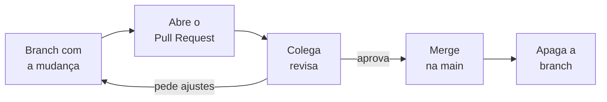

> **Por que revisar?** Porque quem escreveu o código é a pessoa com mais dificuldade de enxergar os próprios erros. A revisão também espalha o conhecimento: depois dela, **duas** pessoas entendem aquela parte do sistema.

### Passo 7.1 — Aluno A: abrir o Pull Request

1. No GitHub, abra **o fork da dupla** (`<usuario-aluno-a>/scm-<nome-a>-<nome-b>`), não o repositório modelo do docente. Deve aparecer um aviso sobre o push recente em `feature/secao-sobre` com o botão **Compare & pull request**. (Se não aparecer: aba **Pull requests → New pull request**.)
2. **Antes de criar o PR, confira os dois repositórios e as branches no topo da comparação:**

   | Campo | Valor correto |
   |---|---|
   | **base repository** | `<usuario-aluno-a>/scm-<nome-a>-<nome-b>` — **o fork da dupla** |
   | **base** | `main` |
    | **head repository** (se aparecer) | `<usuario-aluno-a>/scm-<nome-a>-<nome-b>` — **o mesmo fork** |
   | **compare** | `feature/secao-sobre` |

    > **Atenção:** mesmo começando pelo fork, o GitHub pode sugerir o **repositório do docente** como base. Se o nome do docente aparecer em **base repository**, troque-o pelo fork da dupla antes de continuar. O destino do PR deve ser a `main` **do fork**, não a `main` do modelo.

3. **Título:** `Adiciona seção Sobre`
4. **Descrição:**

   ```markdown
   ## O que muda
   Adiciona a seção "Sobre nós" ao final da página.

   ## Como verificar
   Abrir o index.html no navegador e rolar até o fim da página.

   ## Checklist
   - [x] Testado localmente no navegador
   - [x] Sem alterações fora do escopo
   ```

5. Em **Reviewers**, escolha o Aluno B.
6. Confira mais uma vez que **base repository** mostra o fork da dupla; só então clique em **Create pull request**. Na página do PR criado, confirme que o repositório no topo também é o fork da dupla.

### Passo 7.2 — Aluno B: revisar

1. Abra o PR e vá à aba **Files changed**.
2. Leia a mudança linha a linha.
3. Passe o mouse sobre uma linha e clique no **+** para deixar um comentário. Faça **pelo menos um comentário real**: uma pergunta, uma sugestão de texto ou um elogio específico.
4. Clique em **Review changes**, escolha **Approve** e confirme.

> **Como comentar bem numa revisão:**
>
> | Evite | Prefira |
> |---|---|
> | "Isso está errado." | "Esse texto vai aparecer para o cliente? Sugiro trocar 'sob medida' por 'personalizadas'." |
> | "LGTM" sem ler | Um comentário mostrando que você leu e entendeu a mudança |
> | Criticar a pessoa | Comentar o código |

> **O repositório pode exigir aprovação?** Sim. Em **Settings → Branches**, é possível criar uma regra que impede o merge na `main` sem aprovação. É assim que as empresas garantem que nada entra sem revisão. Neste laboratório a regra é opcional.

### Passo 7.3 — Aluno A: responder e integrar

1. Responda o comentário do colega. Se ele pediu uma mudança e você concorda, altere na **mesma branch**, faça commit e push — o PR se atualiza sozinho.
2. Com o PR aprovado, clique em **Merge pull request → Confirm merge**.
3. Clique em **Delete branch**.

> **As três formas de integrar um PR:**
>
> | Opção | Como fica o histórico | Quando usar |
> |---|---|---|
> | **Create a merge commit** | Mantém todos os commits da branch e cria um commit de merge | Padrão; preserva a história completa. **Use esta no laboratório.** |
> | **Squash and merge** | Junta todos os commits da branch em um só | Branch com muitos commits pequenos de ajuste |
> | **Rebase and merge** | Reaplica os commits da branch sobre a `main`, sem commit de merge | Equipes que preferem histórico linear |

### Passo 7.4 — Aluno A: atualizar o computador

O merge aconteceu **no GitHub**. O seu computador ainda não sabe disso.

```bash
git switch main
git pull origin main
git branch -d feature/secao-sobre
git fetch --prune
```

| Comando | Para quê |
|---|---|
| `git switch main` | Volta para a branch principal |
| `git pull origin main` | Traz o merge feito no GitHub |
| `git branch -d feature/secao-sobre` | Apaga a branch local, que já foi integrada |
| `git fetch --prune` | Remove as referências locais a branches apagadas no GitHub |

> **Evidência 10 — Aluno A:** PR **Merged** (etiqueta roxa), mostrando o título, o comentário do Aluno B e a aprovação.

**Checkpoint 7** — a `main`, no GitHub, contém a seção Sobre.

---

## 10. Parte 8 — Conflito dentro de um Pull Request

**Tempo estimado:** 25 minutos

O PR do Aluno B foi aberto a partir da `main` **antiga**, antes da seção Sobre existir. Enquanto ele trabalhava, a `main` andou. Vamos provocar o caso mais comum no dia a dia: **dois PRs mexendo no mesmo trecho**.

### Passo 8.1 — Aluno B: adicionar um item ao menu

Ainda na branch `feature/secao-contato`, adicione um item ao menu, **logo depois de "Início"**:

```html
<nav>
  <ul class="menu">
    <li><a href="#inicio">Início</a></li>
    <li><a href="#contato">Contato</a></li>
  </ul>
</nav>
```

```bash
git add index.html
git commit -m "Adiciona link Contato ao menu"
git push
```

### Passo 8.2 — Aluno A: fazer o mesmo na `main`, por outra branch

```bash
git switch main
git pull origin main
git switch -c feature/menu-sobre
```

Adicione ao menu, **no mesmo lugar**, logo depois de "Início":

```html
    <li><a href="#inicio">Início</a></li>
    <li><a href="#sobre">Sobre</a></li>
```

```bash
git add index.html
git commit -m "Adiciona link Sobre ao menu"
git push -u origin feature/menu-sobre
```

Abra um PR de `feature/menu-sobre` para `main`, peça revisão ao Aluno B e, **depois da aprovação**, faça o merge.

### Passo 8.3 — Aluno B: abrir o PR e encontrar o conflito

O Aluno B abre o PR de `feature/secao-contato` para `main`. O GitHub mostra:

```
This branch has conflicts that must be resolved
Conflicting files: index.html
```

> **Por quê?** Os dois inseriram uma linha **no mesmo ponto** do menu. O GitHub não sabe em que ordem as duas devem ficar — nem se as duas devem ficar.

### Passo 8.4 — Aluno B: resolver na própria branch

O caminho mais didático é resolver **no seu computador**, trazendo a `main` atual para dentro da sua branch:

```bash
git switch feature/secao-contato
git fetch origin
git merge origin/main
```

```
CONFLICT (content): Merge conflict in index.html
```

Abra o `index.html` e resolva **mantendo os dois itens**, em uma ordem que faça sentido:

```html
    <li><a href="#inicio">Início</a></li>
    <li><a href="#sobre">Sobre</a></li>
    <li><a href="#contato">Contato</a></li>
```

Confira que não restou marcador e conclua:

```bash
git add index.html
git commit -m "Integra main e resolve conflito no menu"
git push
```

Volte ao PR: o aviso de conflito sumiu e o botão de merge ficou disponível.

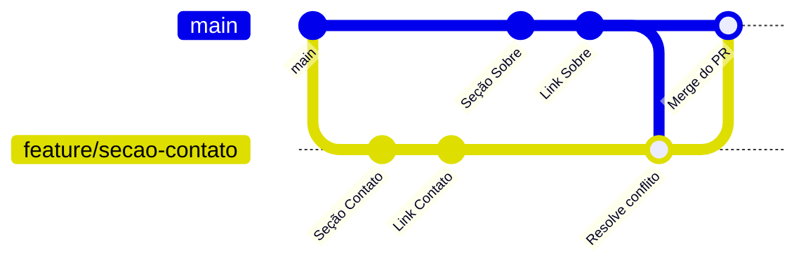

> **Por que não resolver direto na `main`?** Porque a `main` é a versão compartilhada. A resolução acontece **na branch de quem propôs a mudança**, e só depois, já resolvida, passa pela revisão e entra na `main`.

> O GitHub também oferece o botão **Resolve conflicts**, que abre um editor no próprio site. Ele serve para conflitos simples, mas resolver localmente permite **testar a página** antes de enviar.

### Passo 8.5 — Finalizar

1. Aluno A revisa e aprova o PR do Aluno B.
2. Aluno B faz o merge e apaga a branch.
3. Os dois atualizam o computador:

```bash
git switch main
git pull origin main
git fetch --prune
git log --oneline --graph --all
```

> **Evidência 11 — Aluno B:** o PR mostrando o aviso de conflito (antes) e o mesmo PR **Merged** (depois).
> **Evidência 12 — ambos:** saída final do `git log --oneline --graph --all` e a página no navegador com o menu contendo Início, Sobre e Contato.

**Checkpoint 8** — a `main` tem as duas seções e os três itens de menu, e nenhuma branch de funcionalidade permanece aberta.

---

## 11. Parte 9 — Desfazendo coisas com segurança

**Tempo estimado:** 10 minutos · leitura e experimentação livre

Errar faz parte. O que importa é saber **qual comando desfaz o quê** — e quais são perigosos depois do push.

| Situação | Comando | O que acontece |
|---|---|---|
| Alterei um arquivo e quero descartar a alteração | `git restore <arquivo>` | Volta o arquivo ao estado do último commit. **A alteração é perdida.** |
| Dei `git add` sem querer | `git restore --staged <arquivo>` | Tira da staging area; a alteração continua no arquivo |
| Errei a mensagem do último commit, **sem push** | `git commit --amend -m "Nova mensagem"` | Reescreve o último commit |
| Quero desfazer o último commit, **sem push** | `git reset --soft HEAD~1` | Desfaz o commit e mantém as alterações preparadas |
| Quero desfazer um commit **que já foi enviado** | `git revert <id-do-commit>` | Cria um **novo** commit que faz o contrário do anterior |

> **Por que `revert` depois do push, e não `reset`?** O `reset` **apaga** commits do histórico. Se esses commits já estão no GitHub, os seus colegas também os têm — e o histórico da equipe entra em contradição com o seu. O `revert` não apaga nada: ele **acrescenta** um commit de correção. **Regra prática: histórico compartilhado não se reescreve.**

**Experimente:**

```bash
# altere qualquer arquivo e depois descarte
git restore index.html

# crie um commit de teste e desfaça com revert
git log --oneline
git revert <id-de-um-commit-recente>
```

---

## 12. Problemas comuns

### `fatal: not a git repository`

**Causa:** o terminal não está dentro da pasta do projeto.
**Solução:** `cd` até a pasta do repositório clonado. Confira com `git status`.

### `! [rejected] … (fetch first)`

**Causa:** o remoto tem commits que você não tem.
**Solução:**

```bash
git pull origin main
# resolva conflitos, se houver
git push origin main
```

### `fatal: Need to specify how to reconcile divergent branches`

**Causa:** o `pull.rebase` não foi configurado.
**Solução:** `git config --global pull.rebase false` e repita o `pull`.

### Pedido de usuário e senha no terminal, ou `Authentication failed`

**Causa:** o GitHub não aceita a senha da conta em operações do Git.
**Solução:** confira que a URL é HTTPS (`git remote -v`), faça login no GitHub pelo VS Code (Passo 1.5) e repita. Se persistir, crie um **Personal Access Token** no GitHub (Settings → Developer settings) e use-o no lugar da senha.

### Abriu um editor estranho no terminal e não consigo sair

**Causa:** o Git abriu o editor Vim para você escrever a mensagem de merge.
**Solução:** tecle `Esc`, digite `:wq` e `Enter` (salva e sai). Para usar o VS Code como editor daqui em diante:

```bash
git config --global core.editor "code --wait"
```

### Os commits aparecem no GitHub sem o meu avatar

**Causa:** o e-mail do `git config` não é o mesmo da conta do GitHub.
**Solução:** corrija com `git config --global user.email "<e-mail-do-github>"`. Os commits novos passam a ser associados corretamente.

### Marcadores `<<<<<<<` no código depois do conflito

**Causa:** o conflito foi marcado como resolvido sem apagar os marcadores.
**Solução:** apague os marcadores, confira o arquivo, e faça `git add` e `git commit` de novo.

### Não consigo trocar de branch: `Your local changes would be overwritten`

**Causa:** há alterações não registradas que conflitam com a branch de destino.
**Solução:** registre o trabalho (`add` e `commit`) antes de trocar, ou guarde temporariamente com `git stash` e recupere depois com `git stash pop`.

### O Pull Request foi para o repositório do docente

**Causa:** o **base repository** sugerido pelo GitHub não foi corrigido.
**Solução:** feche esse PR e abra outro, escolhendo o fork da dupla como **base repository**.

---

## 13. Resumo de comandos

| Comando | O que faz | Move de → para |
|---|---|---|
| `git clone <url>` | Copia um repositório remoto para o computador | remoto → local |
| `git status` | Mostra o estado dos arquivos e da branch | — |
| `git diff` | Mostra as mudanças ainda não preparadas | — |
| `git add <arquivo>` | Prepara uma mudança para o próximo commit | trabalho → staging |
| `git commit -m "msg"` | Registra as mudanças preparadas | staging → local |
| `git push` | Envia commits locais para o remoto | local → remoto |
| `git fetch` | Baixa novidades do remoto sem alterar seus arquivos | remoto → local (só referências) |
| `git pull` | Baixa e combina: `fetch` + `merge` | remoto → local → trabalho |
| `git log --oneline --graph --all` | Mostra o histórico como grafo | — |
| `git branch` | Lista as branches | — |
| `git switch -c <nome>` | Cria uma branch e muda para ela | — |
| `git switch <nome>` | Muda de branch | local → trabalho |
| `git merge <branch>` | Combina outra branch na atual | — |
| `git merge --abort` | Cancela um merge com conflito | — |
| `git restore <arquivo>` | Descarta alterações de um arquivo | local → trabalho |
| `git revert <id>` | Cria um commit que desfaz outro | — |
| `git remote -v` | Mostra os repositórios remotos configurados | — |

---

## 14. Glossário

| Termo | Definição |
|---|---|
| **Repositório** | Pasta do projeto somada a todo o seu histórico de versões |
| **Commit** | Registro de um estado do projeto, com autor, data, mensagem e referência ao anterior |
| **Staging area** | Área onde se preparam as mudanças que irão para o próximo commit |
| **Remoto** | Cópia do repositório hospedada em outro lugar, como o GitHub |
| **`origin`** | Nome padrão dado ao remoto de onde o repositório foi clonado |
| **Fork** | Cópia de um repositório para a sua conta no GitHub |
| **Clone** | Cópia de um repositório remoto para o seu computador |
| **Branch** | Linha de desenvolvimento independente; tecnicamente, um ponteiro para um commit |
| **`HEAD`** | Indicador de onde você está agora no histórico |
| **Merge** | Combinação do histórico de duas branches |
| **Fast-forward** | Merge em que basta avançar o ponteiro, porque não há trabalho a combinar |
| **Commit de merge** | Commit com dois pais, criado ao combinar históricos que divergiram |
| **Conflito** | Situação em que o Git não consegue combinar as mudanças sozinho e pede decisão humana |
| **Pull Request** | Pedido para integrar uma branch em outra, com revisão antes do merge |
| **Revisão de código** | Leitura crítica das mudanças por outra pessoa antes da integração |

---

## 15. Evidências e entrega

Cada aluno entrega **individualmente** um documento (`.pdf` ou `.docx`) com as evidências abaixo. As capturas de tela devem ser **legíveis** e mostrar o **usuário do GitHub conectado** e a **data e hora do sistema**.

### Lista de evidências

| # | Quem | O que capturar | Parte |
|---|---|---|---|
| 1 | Aluno A | Página inicial do fork com o aviso *"forked from…"* | 2 |
| 2 | Aluno A | **Settings → Collaborators** com o Aluno B listado | 2 |
| 3 | Ambos | Saída do `git clone` e do `git remote -v` | 2 |
| 4 | Aluno A | Aba **Commits** do GitHub com o primeiro commit do Aluno A | 3 |
| 5 | Aluno B | Saída do `git pull` e `index.html` com o título novo | 3 |
| 6 | Aluno B | Saída do `git push` bem-sucedido do Passo 3.7 | 3 |
| 7 | Ambos | `git log --oneline --graph --all` com a bifurcação e o commit de merge | 4 |
| 8a | Aluno B | `style.css` depois da resolução, sem marcadores | 5 |
| 8b | Ambos | Página no navegador com o estilo combinado | 5 |
| 9 | Ambos | Tela **Branches** do GitHub com as três branches | 6 |
| 10 | Aluno A | PR **Merged** com comentário e aprovação do Aluno B | 7 |
| 11 | Aluno B | PR com aviso de conflito (antes) e o mesmo PR **Merged** (depois) | 8 |
| 12 | Ambos | `git log --oneline --graph --all` final e página com o menu completo | 8 |

### Formato de entrega

- **Nome do arquivo:** `SCM_<NomeCompleto>.pdf`
- **Cabeçalho:** Nomes dos participantes e  URL do repositório
- **Corpo:** as evidências numeradas e legendadas

## 16. Referências

- **Pro Git** (livro gratuito, em português): [git-scm.com/book/pt-br/v2](https://git-scm.com/book/pt-br/v2)
- **Learn Git Branching** (tutorial interativo): [learngitbranching.js.org](https://learngitbranching.js.org/?locale=pt_BR)
- **Visualizing Git** (visualização de comandos): [git-school.github.io/visualizing-git](https://git-school.github.io/visualizing-git/)
- **GitHub Flow**: [docs.github.com/pt/get-started/using-github/github-flow](https://docs.github.com/pt/get-started/using-github/github-flow)
- **Sobre Pull Requests**: [docs.github.com/pt/pull-requests](https://docs.github.com/pt/pull-requests)
- **Resolver conflitos de merge**: [docs.github.com/pt/pull-requests/collaborating-with-pull-requests/addressing-merge-conflicts](https://docs.github.com/pt/pull-requests/collaborating-with-pull-requests/addressing-merge-conflicts)
- **Git Cheat Sheet**: [education.github.com/git-cheat-sheet-education.pdf](https://education.github.com/git-cheat-sheet-education.pdf)

---

*Roteiro de atividade — Disciplina de Engenharia de Software.*
